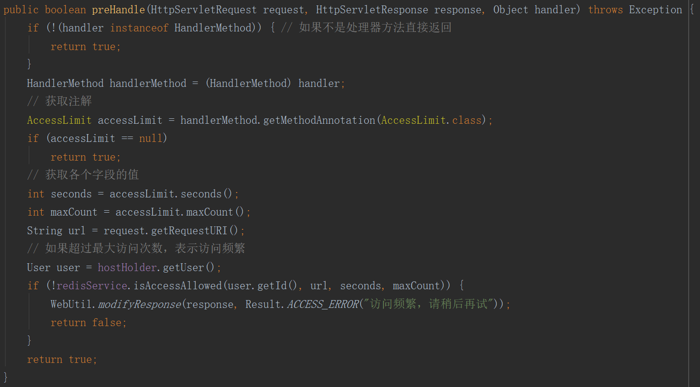

- [miusa](#miusa)
  * [前言](#前言)
  * [登录功能](#登录功能)
    + [两次 MD5 加密密码](#两次-MD5-加密密码)
    + [JSR-380 下使用注解进行参数校验](#JSR-380-下使用注解进行参数校验)
    + [基于 Redis 实现分布式 Session](#基于-Redis-实现分布式-Session)
  * [商品秒杀功能](#商品秒杀功能)
  * [性能优化](#性能优化)
    + [页面优化](#页面优化)
    + [接口优化](#接口优化)
    + [其它优化](#其它优化)
  * [接口安全](#接口安全)
    + [隐藏秒杀地址和图形验证码](#隐藏秒杀地址和图形验证码)
    + [接口防刷](#接口防刷)
  * [参考](#参考)

# miusa
## 前言
这是一个实现了秒杀商品的 spring boot 项目。
开发中遇到的坑以及学习心得参见[开发日志](开发日志/开发日志.md)

## 登录功能

### 两次 MD5 加密密码

密码从用户注册到输入到数据库需要经过两次 MD5 加密。第一次 MD5 发生在客户端浏览器，使用 js 对用户输入的密码进行加密，目的是防止用户密码在网络中明文传输。第二次 MD5 发生在服务端，将用户密码和随机字符串 salt 拼接后再进行 MD5 加密，最后才写入数据库，目的是防止数据库泄露后用户密码随之泄露。

用户在登录时输入的密码，到达服务端后会再次使用 salt 拼接、MD5 加密生成加密字符串，使用这个加密字符串和数据库保存的密码对比，根据是否相等判断密码正确性。由于 MD5 加密是单向的，所以使用这种方式保存隐私数据是很安全的。

### JSR-380 下使用注解进行参数校验

JSR-380 定义的“Bean Validation 2.0”是 JSR-303 定义的“Bean Validation”的第二个版本。[JCP 和 JSRs](https://en.wikipedia.org/wiki/Java_Community_Process)

Hibernate 按照这个规范提供了很多用于参数校验的注解。如`@Email`等。

在这个规范下，我们可以这样子校验参数：1）编写一个注解。2）注解所需要的校验器。3）在需要校验的成员变量上添加注解。4）在参数前加上`@Valid`注解。5）编写处理校验失败时抛出的异常`BindException`的处理器。

```java
@PostMapping("/do_login")
@ResponseBody
public Result login(@Valid LoginVO loginForm, HttpServletResponse response) {
     ···
}
```

如上面这段代码所示，我们把校验业务封装在校验器里，在 Controller 层只有一个`@Valid`注解就能完成参数校验的工作。校验细节如下（验证账号是否为合法手机号）：

```java
public class LoginVO {

    @NotNull
    @IsMobile // 自定义注解
    private String mobile;

    @NotNull
    @Length(min = 1) // hibernate 提供的注解
    private String password;
    
    ···
}
```

注解：

```java
@Target({···})
@Retention(RetentionPolicy.RUNTIME)
@Documented
@Constraint(
        validatedBy = {IsMobileValidator.class}
)
public @interface IsMobile {
// required 和 message 是自定义参数，groups 和 payload 是两个必须包含的参数。
    boolean required() default true;

    String message() default "手机号码格式错误！"; // 校验失败时的错误信息

    Class<?>[] groups() default {};

    Class<? extends Payload>[] payload() default {};
}
```

校验器：

```java
public class IsMobileValidator implements ConstraintValidator<IsMobile, String> {
    private boolean required = true;
    @Override
    public void initialize(IsMobile constraintAnnotation) {
        required = constraintAnnotation.required();
    }

    @Override
    public boolean isValid(String s, ConstraintValidatorContext constraintValidatorContext) {
        if(required || !StringUtils.isEmpty(s)) {
            return ValidationUtil.isMobile(s);
        }
        return true;
    }
}
```

用这种方式校验参数能达到复用校验逻辑，校验逻辑与业务逻辑解耦的目的。

### 基于 Redis 实现分布式 Session

项目中使用基于 Redis 的非粘性 Session 共享机制来进行会话状态管理。

用户登录时，服务器在验证账号密码后会分发给客户一个 token，同时将该 token 存入 Redis 服务器。用户在请求同域名下其他页面时会带上该 token，服务器会根据该 token 从 Redis 服务器中获得相应的用户信息。

## 商品秒杀功能

秒杀流程：

用户点击秒杀之后，浏览器先后发送两次请求，第一次请求获取秒杀地址（MD5 加密的随机字符串），第二次请求根据该地址访问秒杀接口。

秒杀接口首先检查秒杀地址是否有效：将请求路径中包含的随机字符串和缓存中保存的第一次请求产生的秒杀路径对比。

然后判断商品库存是否足够：先从内存标记（一个保存售罄商品 ID 的 Set）中查看，如果内存标记标记了该商品，则直接返回商品售罄的信息给用户，否则通过网络访问 redis 缓存，redis 预减库存，并将减少后的库存数返回。如果返回值小于 0（商品库存不足）则在内存标记中添加该商品 ID，并返回，否则从缓存中根据商品编号读取秒杀订单。如果缓存中有该订单，则直接返回，避免重复下单，否则将订单信息放入消息队列，然后返回排队处理订单的信息，后台异步处理订单。


前台得到一个“正在排队”的响应（返回结果为 0），会不断轮询秒杀结果，如果秒杀成功会的到订单号，秒杀失败则得到一个秒杀失败的响应（返回结果为 -1）。

## 性能优化

秒杀系统的优化是多方面的，参见[秒杀系统优化方案（下）](https://www.cnblogs.com/xiangkejin/p/9351501.html)

本项目中主要从以下两方面入手：页面优化和接口优化。

### 页面优化

一.**动态页面缓存**

一般返回页面时都是依靠 Spring 框架调用`ThymeleafViewResolver`来对返回的视图进行解析。

这个过程可以利用缓存进行优化。当某个页面第一次被请求时可以把渲染后的页面放入缓存，在后面的请求中可以直接从缓存中取得相应页面。


具体流程如上图：1)从缓存中获取。2)如果缓存中没有就通过`ThymeleafViewResolver`渲染。3)将页面存入缓存并返回。


上图中，上面的压测结果是添加页面缓存前（直接返回页面而不存入缓存）的，下面是添加后的。可见添加页面缓存后 cpu 吞吐量翻了个倍。（1000 * 10 = 10000 个线程/请求）

这种方式减小了应用服务器的压力，提高了响应速度，但是把压力转移到了 redis 服务器，同时增加了网络开销，网络状况不好时，这种方式可能适得其反。

二.**页面静态化**

页面静态化就是将页面中模板引擎（例如`thymeleaf`）的相关语句剔除，然后数据部分通过 Ajax 来异步获取。

浏览器请求某页面时，服务器将静态文件目录（`/static`）下的静态模板直接返回给浏览器，浏览器再利用 Ajax 异步获取相关的数据，并用 js 渲染到页面上。这样可以提高打开页面的速度，但也把页面渲染压力转到了浏览器上。

### 接口优化

这里的接口优化指的是对秒杀接口的优化，优化前，秒杀接口的大致流程如下：


上图流程中库存的判断涉及到从数据库取商品信息，秒杀商品涉及下单、更新库存等访问数据库的操作，而实际的秒杀中，请求数量是相当高的。MySQL 是持久化存储，数据存放在磁盘里面，在读写时会涉及到一定的 IO，所以数据库往往成为网站的性能瓶颈。

项目中使用缓存、内存标记等手段预存商品库存，请求到来时优先利用这两处判断商品库存是否充足。我把涉及数据库的秒杀商品的操作与秒杀时限的判断合并在一起，然后让 RabbitMQ 的消费者来执行。

使用内存标记记录已售罄的商品是为了避免随后的请求访问相同商品时访问 redis 数据库，减少网络开销。

```java
@RabbitListener(queues = MQConfiguration.MIUSA_QUEUE)
public void receiveMiusaMessage(String message) {
    MiusaMessage miusaMessage = JSON.parseObject(message, MiusaMessage.class);
    Long userId = miusaMessage.getUserId();
    Long goodsId = miusaMessage.getGoodsId();
    GoodsVO goods = miusaGoodsService.getGoodsVOById(goodsId);
    // 检查是否处于秒杀时间
    long miusaTime = miusaMessage.getMiusaTime();
    boolean onTime = miusaGoodsService.checkTime(goods, miusaTime);
    if (onTime) { // 如果处于秒杀时间则进行秒杀
        try {
            miusaGoodsService.miusa(goods, userId);
        } catch (Exception e) {
            log.info("failedTask - " + failedTask.incrementAndGet());
        }
    }
}
```

这样整个秒杀接口就只剩下内存操作、缓存操作以及将消息发送到消息队列的操作：

```java
@PostMapping("/{path}/do_miusa")
@ResponseBody
public Result doMiusa(@RequestParam Long goodsId,
                      @PathVariable String path) {
    // 检查路径合法性
    boolean isValidPath = miusaGoodsService.checkPath(path, goodsId);
    if (!isValidPath) {
        return Result.ERROR("非法路径");
    }
    // 从内存中查看商品是否售罄
    if (goodsNotInStock.contains(goodsId)) {
        return Result.GOOD_ERROR("手慢一步！商品已售罄");
    }
    // 访问 redis，预减库存
    Long stock = redisService.preReduceStock(goodsId);
    if (stock < 0) {
        goodsNotInStock.add(goodsId); // 标记售罄的商品，避免下次请求访问 redis 产生的开销。
        return Result.GOOD_ERROR("手慢一步！商品已售罄");
    }
    // 判断是否已经秒杀
    MiusaOrder miusaOrder = miusaOrderService.getMiusaOrderByGoodsId(goodsId);
    if (miusaOrder != null) {
        return Result.ORDER_ERROR("您已下单，请前往查看");
    }
    // 将订单放到消息队列异步处理，然后返回排队等候的状态
    MiusaMessage message = getMiusaMessage(goodsId);
    msgSender.sendMiusaMessage(message);
    return Result.SUCCESS(OrderResult.WAITING.getValue());
}
```

大致流程和[商品秒杀功能](#商品秒杀功能)中提到的一样，下面是优化前后压测对比。


上图是优化前的压测结果


上图是优化后的压测结果，可见系统吞吐量有了很大的提升。

### 其它优化

一.**Web 前端性能优化**

1.**浏览器访问优化**

1）减少 Http 请求：合并 CSS、JavaScript、图片等静态资源，只用一次请求就把这些资源同时下载下来。

2）使用浏览器缓存：将上述静态资源缓存到浏览器，通过设置 HTTP 头中的`Cache-Control`和`Expires`属性设置缓存时间。

3）使用压缩：服务器压缩文件，浏览器解压文件。缺点是压缩解压会给服务器和浏览器带来压力。

4）CSS 放在页面最上面，JavaScript 放在最下面：浏览器会在下载完全部的 CSS 之后才渲染页面。

5）减少 cookie 传输：对于静态资源的访问，发送 Cookie没有意义，使用独立域名访问静态资源，避免请求静态资源时发送 Cookie。

2.**CDN（Content Distribute Network，内容分发网络) 缓存静态资源**


3.**反向代理**


反向代理服务器能为网站提供防火墙等安全功能、也能通过配置缓存和负载均衡提升网站性能。

代理服务器能缓存静态资源，有些网站也用它缓存动态资源，通过内部通知机制，反向代理能及时更新动态资源。

二.**应用服务器性能优化**

1.**分布式缓存**：优先考虑使用缓存优化性能。

合理使用缓存：1）缓存不经常修改的内容（读写比 2:1 以上）。2）根据二八定律，缓存热点数据。3）数据不一致与脏读：应用要容忍一定时间的数据不一致。4）缓存可用性：使用分布式缓存服务器集群。5）缓存预热：在缓存系统启动时就把热点数据加载好，避免新启动的缓存系统没有数据导致数据库负载过大。6）缓存穿透：将不存在的数据也缓存起来（value 值为 null）。

2.**异步操作**：使用消息队列将调用异步化可以解耦系统，改善网站拓展性，也能起到削峰、限流的作用。

3.**使用集群**：使用负载均衡技术为一个应用构建一个由多台服务器组成的服务器集群，将并发访问请求分发到多态服务器上处理。

4.**代码优化**：1）多线程编程。2）资源复用的两种模式：单例（Singleton，无状态对象、spring 默认构造的对象都是单例）和对象池（object pool，线程池和连接池）。3）合适的数据结构。4）垃圾回收：JVM 调优，尽量减少 Full GC。

## 接口安全

### 隐藏秒杀地址和图形验证码

在用户秒杀商品时前后至少发送两次请求。第一次请求向服务器获取秒杀地址。第二次通过上一步获取的秒杀地址进行秒杀。

项目中使用 Ajax 访问服务器分发秒杀地址的接口。接口进行对商品编号进行验证然后返回给用户一个随机字符串，并把该串存到 redis 中，这段字符串是变化的，因此秒杀请求地址是动态的；客户端得到该串后进行秒杀地址拼接，然后向服务器发送第二次请求，服务器从路径参数中得到之前分发给客户端的随机串，并从 redis 数据库中取出比对，验证成功后，进行秒杀商品业务。

这样做的目的是防止刷客恶意刷秒杀接口。

不过仅仅靠隐藏秒杀地址无法阻止恶意刷秒杀接口的行为，因为刷客可以在获取秒杀地址后发送第二次请求，刷秒杀接口，这时就需要添加图形验证码来防御刷客。浏览器在加载秒杀界面时使用 Ajax 请求服务器获取图形验证码，服务器生成验证码并将验证结果存入缓存，用户输入验证码后提交到获取秒杀地址的接口，该接口完成图形校验，校验成功才会返回给用户秒杀地址。然后浏览器才能继续访问秒杀接口。由于验证码的多样性和复杂性（比如数学公式验证码、行为验证码等），机器人、脚本等工具难以应付，刷客得不到秒杀地址，也就无法刷秒杀接口了。

### 接口防刷

可以利用缓存记录用户请求的频率，由于访问流量限制是一个业务无关的服务，我们把它当成一个切面来处理。具体实现：

1）在需要流量限制的接口上添加注解。


2）对请求拦截，这里请求是`DispatcherServlet`根据处理器映射`HandlerMapping`分发来的，我们可以得到处理请求的处理器方法，进而得到修饰它的注解，根据注解各个字段的值对请求进行处理。



这样限流的逻辑就被解耦出来了。在需要限流的接口上添加一个注解就好了，非常方便。


### 参考

若鱼1919.Java秒杀系统方案优化 高性能高并发实战.慕课网

李智慧.大型网站技术架构：核心原理与案例分析.电子工业出版社.2013

流程图来自[ProcessOn](https://www.processon.com)
