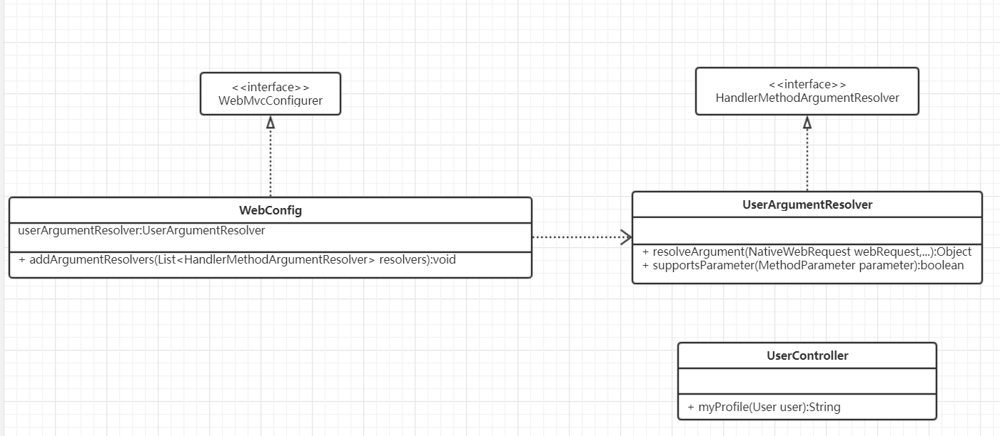

[TOC]

# 2019年

## 4月4日

秒杀接口地址隐藏：在秒杀开始之前无法拿到秒杀地址（确保公平）。

验证码作用：1）防止机器人。2）增加用户在页面的停留时间，也拉长了用户对服务器的访问时间，有效削峰，但会影响用户体验。

两次 MD5：1）在客户端进行一次 MD5，避免用户密码在网络上明文传输。2）在服务端进行第二次 MD5，这次 MD5 需要加 salt，防止因为数据库数据泄露导致用户密码泄露。

## 4月5日

1.登录表单的服务器验证：可以利用注解的形式对请求参数进行基本验证（验证参数格式等）。可以设置一个全局异常处理器，如果验证失败，异常处理器能接收到一个```BindException```，然后进行验证失败的处理流程。详见项目中```LoginController.login()```、```GlobalException.handleBindException()```。

2.可以使用```HandlerMethodArgumentResolver```为每一个需要读取用户信息的控制器方法注入```User```实例。

如上图，首先我们需要实现一个```HandlerMethodArgumentResolver```，重写```supportsParameter```方法，设置本解析器能支持的方法参数类型（```parameter.getParameterType() == User.class ? 支持User类型 : 不支持```）。重写```resolveArgument```方法，该方法返回一个我们需要的控制器方法参数实例。对于上图来说，就是一个```User```实例，该实例保存了访问用户的信息。我们可以使用```webRequest```的相关方法获取```HttpServletRequest```和```HttpServletResponse```从请求中获取 token 或者设置 token，再根据获得的 token 获取相关用户信息。最后方法将该实例返回。SpringMVC 会替我们把该实例注入每一个需要它的控制器方法，例如上图```UserController```的```myProfile```方法。

第二步就是实现一个```WebMvcConfigurer```，重写它的```addArgumentResolvers```方法，把上一步实现的```HandlerMethodArgumentResolver```注册（```resolvers.add(userArgumentResolver)```）即可。

使用上面所说的方式能将每次用户访问时的 token 验证、设置新 token 等服务抽取出来，而不需要在每个控制器方法获取了。

我们使用 Redis 数据库保存用户信息，使用“字符串”结构保存用户信息(```<token，user>```)，这是本项目实现分布式 Session 的基础。

3.一个坑：使用拦截器时，发现访问登录页面控制台会打印如下日志：


检查配置类，发现没有把静态文件的访问路径排除掉，修改后如下：


注意：斜杠后两个星号"**"。

## 4月6日

1.数据库数据 ID 不设置自增，是为了防止被恶意遍历库。通常使用 **snowflake** 算法生成随机ID。

2.service 层不要引入别的模块的 DAO，如有需要，只能引入对应的 Service。

### 页面优化技术

3.一般返回页面时都是依靠 Spring 框架调用`ThymeleafViewResolver`来对返回的视图进行解析。

这个过程可以利用缓存进行优化。当某个页面第一次被请求时可以把渲染后页面放入缓存，在后面的请求中可以直接从缓存中取得相应页面。


具体流程如上图：1)从缓存中获取。2)如果缓存中没有就通过`ThymeleafViewResolver`获取。3)将页面存入缓存并返回。

注意：代码修改之后需要把拦截器中的`postHandle()`删掉，因为加上`@ResponseBody`注解之后，在方法执行完毕后直接返回响应，不会进行视图渲染，执行`postHandle()`方法时响应已经被提交，此时会报错。