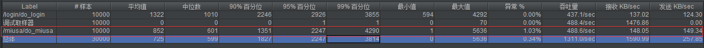

[TOC]

# 2019年

## 4月4日

秒杀接口地址隐藏：在秒杀开始之前无法拿到秒杀地址（避免用户直接访问下单页面）。

验证码作用：1）防止机器人。2）增加用户在页面的停留时间，也拉长了用户对服务器的访问时间，有效削峰，但会影响用户体验。

两次 MD5：1）在客户端进行一次 MD5，避免用户密码在网络上明文传输。2）在服务端进行第二次 MD5，这次 MD5 需要加 salt，防止因为数据库数据泄露导致用户密码泄露。

## 4月5日

1.登录表单的服务器验证：可以利用注解的形式对请求参数进行基本验证（验证参数格式等）。可以设置一个全局异常处理器，如果验证失败，异常处理器能接收到一个```BindException```，然后进行验证失败的处理流程。详见项目中```LoginController.login()```、```GlobalException.handleBindException()```。

2.可以使用```HandlerMethodArgumentResolver```为每一个需要读取用户信息的控制器方法注入```User```实例。

如上图，首先我们需要实现一个```HandlerMethodArgumentResolver```，重写```supportsParameter```方法，设置本解析器能支持的方法参数类型（```parameter.getParameterType() == User.class ? 支持User类型 : 不支持```）。重写```resolveArgument```方法，该方法返回一个我们需要的控制器方法参数实例。对于上图来说，就是一个```User```实例，该实例保存了访问用户的信息。我们可以使用```webRequest```的相关方法获取```HttpServletRequest```和```HttpServletResponse```从请求中获取 token 或者设置 token，再根据获得的 token 获取相关用户信息。最后方法将该实例返回。SpringMVC 会替我们把该实例注入每一个需要它的控制器方法，例如上图```UserController```的```myProfile```方法。

第二步就是实现一个```WebMvcConfigurer```，重写它的```addArgumentResolvers```方法，把上一步实现的```HandlerMethodArgumentResolver```注册（```resolvers.add(userArgumentResolver)```）即可。

使用上面所说的方式能将每次用户访问时的 token 验证、设置新 token 等服务抽取出来，而不需要在每个控制器方法获取了。

我们使用 Redis 数据库保存用户信息，使用“字符串”结构保存用户信息(```<token，user>```)，这是本项目实现分布式 Session 的基础。

3.一个坑：使用拦截器时，发现访问登录页面控制台会打印如下日志：


检查配置类，发现没有把静态文件的访问路径排除掉，修改后如下：


注意：斜杠后两个星号"**"。

## 4月6日

1.数据库数据 ID 不设置自增，是为了防止被恶意遍历库。通常使用 **snowflake** 算法生成随机ID。

2.service 层不要引入别的模块的 DAO，如有需要，只能引入对应的 Service。因为其他模块的 Service 可能耦合了缓存等其必需的功能。只使用其对应模块的 DAO 无法使用附加的功能。

### 页面优化技术

一.动态页面缓存

一般返回页面时都是依靠 Spring 框架调用`ThymeleafViewResolver`来对返回的视图进行解析。

这个过程可以利用缓存进行优化。当某个页面第一次被请求时可以把渲染后的页面放入缓存，在后面的请求中可以直接从缓存中取得相应页面。


具体流程如上图：1)从缓存中获取。2)如果缓存中没有就通过`ThymeleafViewResolver`渲染。3)将页面存入缓存并返回。

注意：代码修改之后需要把拦截器中的`postHandle()`删掉，因为加上`@ResponseBody`注解之后，在方法执行完毕后直接返回响应，不会进行视图渲染，执行`postHandle()`方法时响应已经被提交，此时会报错。


上图中，上面的压测结果是添加页面缓存前的，下面是添加后的。可见添加页面缓存后 cpu 吞吐量翻了个倍。（1000 * 10 = 10000 个线程/请求）

二.页面静态化

页面静态化就是将页面中模板引擎（例如`thymeleaf`）的相关语句剔除，然后数据部分通过 Ajax 来获取。

服务器将静态文件目录（`/static`）下的模板返回给浏览器，浏览器再利用 Ajax 异步获取相关的数据，这样可以提高服务器的响应速度。

三.浏览器缓存

浏览器在收到服务器传来的页面时会将页面进行缓存（开发者工具中未勾选`Disable cache`时），在用户再一次访问相同页面时，浏览器会在请求头中设置`If-Modified-Since`字段，服务器根据该字段以及请求的页面的修改事件判断是否需要返回给客户端页面。如果页面的最近更改时间与`If-Modified-Since`字段一致，那么就不返回页面并且返回[304状态码](https://baike.baidu.com/item/304状态码/7867141)，浏览器得到该响应后从缓存中读取页面。

四.静态资源优化

1.JS/CSS 压缩，减少文件体积。自动去除空白字符和注释从而减小页面的体积。如：`webpack`、`Tengine`对静态文件打包。

2.组合多个CSS、JavaScript文件的访问请求变成一个请求。如：[Tengine](http://tengine.taobao.org) WEB服务器。

3.将静态资源部署在 CDN 上，实现就近访问。


五.对象缓存

对象缓存主要是缓存从数据库中读取的用户信息`User`等数据进行缓存，一个对象对应数据库中的一行数据。当某行数据更新时，如果该行更新成功，需要同时让缓存中的数据失效，然后存入新的缓存信息。[高性能网站设计之缓存更新的套路](https://coolshell.cn/articles/17416.html)

## 4月7日

1.1）数据完整性：利用唯一索引避免用户重复下单。2）在减少库存时判断库存是否大于 0 或者将库存设置为无符号整数（值为负时执行的 SQL 语句会报错），避免请求过多时超卖。3）使用事务保证减少库存和下单的原子性。

2.接口地址隐藏：在用户秒杀商品时前后至少发送两次请求。第一次请求向服务器获取秒杀地址。第二次通过上一步获取的秒杀地址进行秒杀。

项目中使用 Ajax 访问服务器分发秒杀地址的接口。接口进行对商品编号进行验证然后返回给用户一个随机字符串，并把该串存到 redis 中，这段字符串是变化的，因此秒杀请求地址是动态的；客户端得到该串后进行秒杀地址拼接，然后向服务器发送第二次请求，服务器从路径参数中得到之前分发给客户端的随机串，并从 redis 数据库中取出比对，验证成功后，进行秒杀商品业务。

这样做的目的是，确保秒杀开始后（这时才能访问分发秒杀地址的接口），秒杀接口可访问，防止刷客恶意刷秒杀接口。[秒杀系统优化方案（下）](https://www.cnblogs.com/xiangkejin/p/9351501.html)

## 4月9日

1.RabbitMQ 四种交换机模式：direct、topic、fanout、header。

### 拦截器拦截 Ajax 请求

项目中我使用拦截器进行用户身份鉴别，当我根据 token 找不到对应的用户时，则判定当前用户未登录，需要返回状态信息。通常我们可以直接让浏览器重定向到登录页面（```response.sendRedirect("/login");```）。但如果是 Ajax 请求，这么做就不能达到目的了，我们需要对拦截流程进行修改，修改后如下：


上图第 59 行如果不添加会出现乱码的情况，第 60 行如果不设置请求体类型的话会出现前台把响应体当成普通文本解析的情况。

2.秒杀流程：


上图中，在判断的到库存数小于等于 0 时，对商品进行标记，可以使用 Map 或 Set 来记录已经售罄的商品编号，在下一个请求到达时，可以从该记录中查看商品是否售罄，如果售罄直接返回，不需要访问远程 redis 数据库，这样可以减少网络开销。

## 4月11日

### 集成消息队列（RabbitMQ)

1）配置 erlang 语言环境、下载 RabbitMQ，spring boot 添加依赖。

2）先压测一下没集成消息队列之前的秒杀接口（每次启动 1000 个线程，循环 10 次，共 1w 个线程）：



由上图第三行看出此时吞吐量并不高（图中少量的请求异常来自同一用户重复下单，需要在程序中将 mybatis 产生的异常进行捕获），接口的性能瓶颈在 MySQL 上，检查秒杀接口，有多处访问数据库操作，分别是获取商品信息、减少库存以及下单。下面分别对这三处进行优化。

3）修改秒杀接口，利用 redis 预减内存，然后将原先数据库访问的相关操作全部让消息队列处理，我们将秒杀商品所需要的参数封装在```MiusaMessage```中，然后利用```AmqpTemplate```将消息发送到队列中，再由消息接收者完成原先在秒杀接口中的数据库相关操作。


4）压测使用消息队列后的秒杀接口（每次启动 1000 个线程，循环 10 次，共 1w 个线程）：


可以看出，继承了 RabbitMQ 后，吞吐量翻了倍。

### 接口限流

采用注解的方式对接口进行限流。

具体做法是编写一个用于限制接口访问次数的注解`@AccessLimit`，其中```seconds```、```maxCount```表示多少秒内最大访问次数。然后添加一个拦截器对`/miusa`路径下的控制器方法（`Handler`)进行拦截，对添加了注解的方法进行验证，如果超出注解限定的访问次数，则提前响应此次请求。

项目使用滑动窗口算法限流，随着时间推移，窗口向前移动。每次请求到来时先计算窗口内的访问次数，窗口的大小就是时间间隔。访问次数 / 窗口大小 = 访问频率。

## 4月12日
### JMeter 模拟 1W 个不同用户进行压测（参考[Jmeter中cookie自动存储](https://www.cnblogs.com/changshuo/p/5830493.html)）

在压测一些接口时，需要模拟大量不同用户的访问，可能需要 token 来进行身份验证。在本项目中，用户访问秒杀接口的请求首先会被拦截器拦截，拦截器会检查请求中 cookie 携带的 token，这时可以采用如下两种方法进行模拟。

1.可以事先生成 1w 个 token，然后在 JMeter 中进行如下操作（假设事先已在测试计划中添加好线程组）：

1）右击线程组 -> 添加 -> 配置元件 -> CSV 数据文件设置


点“文件名”旁的“浏览”，选中保存 token 的文件，然后“变量名称”一栏为 token 命名。以后可以直接用该变量名获取 token，具体参考下一步。

2）使用`${变量名}`的方式获取从数据文件中读取的变量。


如图红框，使用`${token}`获取 token，这里的变量名要对应第一步设置的变量名称。

2.也可以使用`HTTP Cookie管理器`保存 token。具体操作如下：

1）打开`%JMETER_HOME%\bin\jmeter.properties`文件，将`CookieManager.save.cookies=true`设置上。

2）在线程组中添加`HTTP Cookie管理器`。

3）右键线程组 -> 添加 -> 取样器 -> 调试取样器；

​		    -> 监听器 -> 察看结果树。

4）`HTTP Cookie管理器`默认使用`COOKIE_对应key`保存 cookie，该前缀可以在配置文件中更改，后缀是服务器设置的 cookie 的名称，在本项目中为“token”。所以可以使用`${COOKIE_token}`获取到 token。

5）添加一个获取 token 的 HTTP 请求和一个使用 token 的 HTTP 请求。

右键线程组 -> 添加 -> 取样器 -> HTTP请求

如下图选中的两个 HTTP请求：


6）第一个线程使用方式1从文件中读取账号和密码，然后访问登录接口，登录接口返回的 token 会被`HTTP Cookie管理器`保存，然后紧接着第二个接口会从`HTTP Cookie管理器`中获取 token 并使用。


(显示原因，“COOKIE_”的下划线没显示)

设置完之后就可以在“线程组”中设置线程数量进行压测了。

## 5月25日


使用滑动窗口算法实现限流。每次访问网站都会将时间限制（滑动窗口）外的访问记录 stamp 删除，然后计算剩余的访问记录数量，如果该数量超过限制的数量则会拒绝访问。

## 6月2日

### 关于秒杀业务的一些思考

1. 利用复杂的验证码或者答题来防秒杀器并达到削峰限流的目的。
2. 成功下单后不算秒杀成功，付款之后才算秒杀成功。
3. 每人限购秒杀数量。

4. 对反复下单却不付款的用户打标记，限制其下单行为。

## 6月6日

### 秒杀系统应对策略

- 秒杀系统独立部署：部署在独立的服务器或集群上，使用独立域名。和普通商品进行隔离。
- 秒杀商品页面静态化：直接将商品的描述信息、评价等内容静态化到页面上，不进行渲染、数据库访问。
- 租借秒杀活动网络带宽：向运营商或 CDN 服务商租借额外的带宽。
- 下单页面地址隐藏：在下单页面 URL 加入服务器生成的随机字符串，确保活动开始前用户不能访问到下单页面。

## 10月7日

### 减库存的三种方式

- 下单减库存：在下单时就扣除库存。缺点是容易被恶意用户刷单但不支付，导致其它用户不能正常购买。
- 预减库存：在下单时扣除库存，给定一个期限来付款，超出期限则自动退单并进行库存回补。优点是一定程度缓解了恶意刷单不支付行为。缺点是库存回补操作的实现是一个难点。
- 付款减库存：在付款时减少库存。缺点是调用第三方支付接口时完成付款操作和减少库存不是原子的，一致性的保证是个难点。